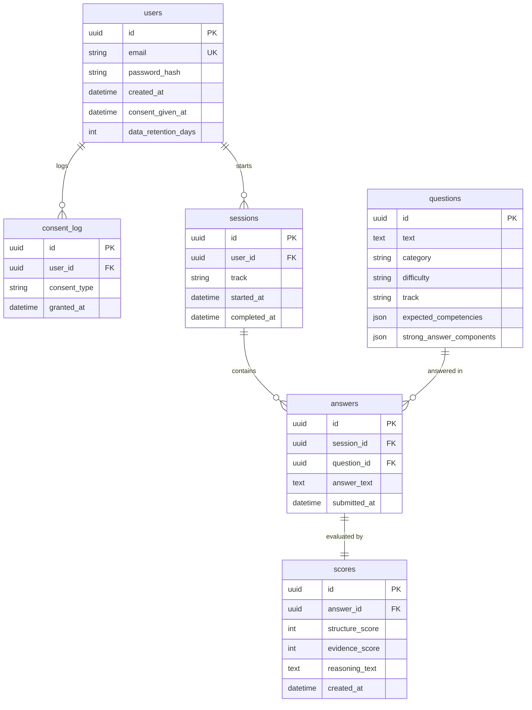

# Implementation Plan: InterviewAI (Phase 0 + Phase 1)

Building the foundation and core MVP loop for **InterviewAI**, an adaptive, evidence-based interview coaching web application with evidence-grounded LLM scoring.

---

## User Review Required

> [!IMPORTANT]
> **Database Schema & LLM Provider Configuration**
> Please review the proposed database schema, track definitions, and LLM fallback strategy below. Once approved, we will immediately proceed with the step-by-step implementation.

---

## 1. Database Schema Proposal

The data model uses PostgreSQL (with SQLite compatibility for zero-config local testing if PostgreSQL service is not running locally). All primary keys use standard UUIDs for security and consistency.



### Table Definitions
1. **`users`**
   - `id`: UUID (Primary Key)
   - `email`: String (Unique, Indexed)
   - `password_hash`: String (bcrypt hash)
   - `created_at`: DateTime (UTC, default now)
   - `consent_given_at`: DateTime (Nullable, timestamp of consent acceptance)
   - `data_retention_days`: Integer (default `365`)

2. **`consent_log`**
   - `id`: UUID (Primary Key)
   - `user_id`: UUID (Foreign Key -> `users.id` on delete cascade)
   - `consent_type`: String (e.g. `"privacy_and_ai_evaluation"`)
   - `granted_at`: DateTime (UTC, default now)

3. **`questions`**
   - `id`: UUID (Primary Key)
   - `text`: Text (Question prompt)
   - `category`: String (`"behavioral"` | `"technical"`)
   - `difficulty`: String (`"easy"` | `"medium"` | `"hard"`)
   - `track`: String (e.g. `"SDE — Behavioral"`, `"SDE — Technical"`)
   - `expected_competencies`: JSON / Array of strings (e.g. `["conflict resolution", "communication"]`)
   - `strong_answer_components`: JSON / Array of strings (Rubric checklist items)

4. **`sessions`**
   - `id`: UUID (Primary Key)
   - `user_id`: UUID (Foreign Key -> `users.id` on delete cascade)
   - `track`: String (e.g. `"SDE — Behavioral"`, `"SDE — Technical"`)
   - `started_at`: DateTime (UTC, default now)
   - `completed_at`: DateTime (Nullable, populated when all questions completed)

5. **`answers`**
   - `id`: UUID (Primary Key)
   - `session_id`: UUID (Foreign Key -> `sessions.id` on delete cascade)
   - `question_id`: UUID (Foreign Key -> `questions.id` on delete cascade)
   - `answer_text`: Text
   - `submitted_at`: DateTime (UTC, default now)

6. **`scores`**
   - `id`: UUID (Primary Key)
   - `answer_id`: UUID (Foreign Key -> `answers.id` on delete cascade, Unique)
   - `structure_score`: Integer (`0` to `100`)
   - `evidence_score`: Integer (`0` to `100`)
   - `reasoning_text`: Text (Non-generic, grounded evaluation citing user's exact answer phrases)
   - `created_at`: DateTime (UTC, default now)

---

## 2. Architecture & Tech Stack

### Backend (`FastAPI`)
- **Framework**: FastAPI + Pydantic v2
- **ORM & DB**: SQLAlchemy 2.0 with Alembic / declarative base
- **Auth**: JWT tokens (via `python-jose` / `pyjwt`) + `passlib[bcrypt]` / `bcrypt`
- **LLM Evaluator**: Pluggable client supporting Claude API (`anthropic`), OpenAI (`openai`), Gemini, and a smart local rule-based evidence evaluator fallback for offline/test environments.
- **Directory Structure**:
  ```
  backend/
  ├── app/
  │   ├── api/
  │   │   ├── auth.py          # /auth/signup, /auth/login
  │   │   ├── consent.py       # /consent
  │   │   ├── questions.py     # /questions
  │   │   └── sessions.py      # /sessions, /sessions/{id}/answers, /sessions/{id}/report
  │   ├── core/
  │   │   ├── config.py        # Settings from .env
  │   │   ├── database.py      # SQLAlchemy session engine
  │   │   └── security.py      # Password hashing & JWT logic
  │   ├── models/              # SQLAlchemy models
  │   ├── schemas/             # Pydantic request/response schemas
  │   ├── services/
  │   │   └── evaluator.py     # Core LLM Rubric Evaluator prompt & client
  │   ├── deps.py              # Auth & DB dependency injection
  │   └── main.py              # FastAPI app & CORS configuration
  ├── scripts/
  │   └── seed_questions.py    # 25 seed questions populator
  └── requirements.txt
  ```

### Frontend (`Next.js App Router + TypeScript + Tailwind CSS`)
- **Pages / Routes**:
  - `/` -> Landing / redirect
  - `/auth/signup` & `/auth/login` -> Auth forms
  - `/consent` -> One-screen mandatory consent notice
  - `/dashboard` -> Track picker (e.g. "SDE — Behavioral", "SDE — Technical") & past session history
  - `/session/[id]` -> Interactive interview room: presents 1 question at a time (5 per session), live word count, submission with immediate score & grounded reasoning breakdown, "Next Question" progression
  - `/session/[id]/report` -> Comprehensive session scorecard: aggregate metrics, question-by-question breakdown of structure/evidence scores & grounded reasoning citations
- **State & API client**: Modular typed API client with token storage and session state handling.

---

## 3. The LLM Evaluator Prompt

```text
You are an expert interview evaluator evaluating a candidate's answer against a strict rubric.

Question: {question_text}
Category: {category}
Expected Competencies: {expected_competencies}
Strong Answer Rubric Components: {strong_answer_components}

Candidate's Answer:
"""{candidate_answer}"""

Evaluation Guidelines:
1. structure_score (0-100): Evaluate the clarity, logical progression, and framework (e.g., STAR method for behavioral, architectural organization for technical).
2. evidence_score (0-100): Evaluate the concrete specifics, metrics, technical depth, actions taken, and tangible outcomes mentioned.
3. reasoning: Must be 2-4 sentences explaining the scores, citing specific quotes or parts of the user's answer directly against specific rubric components. Never produce generic praise or feedback. If the answer is too short or off-topic to evaluate meaningfully, state that directly in reasoning.

Respond ONLY with valid JSON in this exact shape:
{
  "structure_score": <int 0-100>,
  "evidence_score": <int 0-100>,
  "reasoning": "<2-4 sentences citing specific parts of the answer>"
}
```

---

## 4. Proposed Changes & Implementation Steps

### Phase 1: Database & Backend Setup
1. **Clean up backend folders**: Remove empty placeholder directories and setup `requirements.txt` with FastAPI, Uvicorn, SQLAlchemy, Pydantic, Passlib, Bcrypt, PyJWT, Python-dotenv, Anthropic / OpenAI / httpx.
2. **Core Config & DB Engine**: Create `app/core/config.py`, `app/core/database.py`, `app/core/security.py`.
3. **SQLAlchemy Models & Pydantic Schemas**: Define `User`, `ConsentLog`, `Question`, `Session`, `Answer`, `Score`.
4. **Seed Script**: Create `scripts/seed_questions.py` containing the 25 required seed questions (15 behavioral, 10 technical).
5. **API Endpoints**:
   - `POST /auth/signup`, `POST /auth/login`
   - `POST /consent`
   - `GET /questions?track=X`
   - `POST /sessions`
   - `POST /sessions/{id}/answers`
   - `GET /sessions/{id}/report`
6. **LLM Evaluator Service**: Implement `evaluator.py` with Anthropic / OpenAI / Gemini integration and a resilient fallback evaluator for test runs without live API keys.

### Phase 2: Next.js Frontend Setup
1. **Initialize Next.js App**: Create App Router Next.js application with TypeScript and Tailwind CSS in `frontend/`.
2. **API Client & Auth Context**: Create typed API client managing JWT auth, user session, and error handling.
3. **Screens**:
   - Signup / Login with responsive UI.
   - Consent screen (one-screen modal/page before proceeding).
   - Track selection dashboard ("SDE — Behavioral", "SDE — Technical", etc.).
   - Interactive Interview Room (one question at a time, live feedback after submission).
   - Comprehensive Session Report with scores, radar/progress indicators, and cited reasoning text.

---

## 5. Verification Plan

### Automated & Backend Verification
- Run backend tests verifying:
  - Auth registration & JWT issuance.
  - Consent recording.
  - Session creation & question retrieval.
  - Answer evaluation & score calculation.
  - Full report generation.
- Seed database script execution verifying 25 questions loaded.

### End-to-End Flow Verification
- Start FastAPI dev server on `http://localhost:8000`.
- Start Next.js dev server on `http://localhost:3000`.
- Walkthrough end-to-end user flow in browser:
  1. Signup new user -> accept consent.
  2. Select "SDE — Behavioral" track.
  3. Answer questions and verify the live structured scoring + grounded reasoning citations.
  4. Complete session and inspect final session report.
